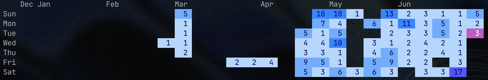

# gitviz


[](https://opensource.org/licenses/MIT)

`gitviz` visualizes commit activity from your local Git repositories as a GitHub-style contribution graph in the terminal.



## Quick Start

Register repositories first, then render the graph.

```sh
gitviz -add ~/src
gitviz
```

By default, `gitviz` reads your commit email from:

```sh
git config user.email
```

You can pass an email explicitly when needed.

```sh
gitviz -graph your.email@example.com
```

Registered repositories are stored in:

```sh
~/.gitlocalstats
```

## Try Without Installing

If you use Nix with flakes enabled, run the latest version from GitHub without installing it.

```sh
nix run --refresh github:anton-fuji/gitviz
```

Pass options after `--`.

```sh
nix run --refresh github:anton-fuji/gitviz -- -days 365 -color blue
```

## Install

### Homebrew

```sh
brew tap anton-fuji/gitviz
brew install gitviz
```

### Go

```sh
git clone https://github.com/anton-fuji/gitviz.git
cd gitviz
go install .
```

## Usage

### Register Repositories

Scan a parent directory and save all Git repositories found under it.

```sh
gitviz -add /path/to/projects
```

`gitviz` skips repeated entries when updating `~/.gitlocalstats`.

### Show The Graph

```sh
gitviz
```

Show activity for a specific email.

```sh
gitviz -graph your.email@example.com
```

Show a longer range.

```sh
gitviz -days 365
```

Show commit counts inside each cell.

```sh
gitviz -numbers
```

Combine options.

```sh
gitviz -days 365 -numbers -color purple
```

## Color Themes

The default theme is `green`. Today is always emphasized with a pink accent.

| Theme | Command |
| --- | --- |
| Green | `gitviz -color green` |
| Blue | `gitviz -color blue` |
| Purple | `gitviz -color purple` |
| Orange | `gitviz -color orange` |
| Gray | `gitviz -color gray` |

Color themes work in both compact mode and `-numbers` mode.

```sh
gitviz -color orange
gitviz -numbers -color orange
```

## Options

| Flag | Default | Description |
| --- | --- | --- |
| `-add <path>` | none | Scan a directory and register Git repositories. |
| `-graph <email>` | `git config user.email` | Email address used to filter commits. |
| `-days <number>` | `183` | Number of days to show. |
| `-numbers` | `false` | Show commit counts inside graph cells. |
| `-color <theme>` | `green` | Graph color theme: `green`, `blue`, `purple`, `orange`, `gray`. |

## Development

```sh
go test ./...
go run . -graph your.email@example.com
```

With Nix:

```sh
nix develop
nix run . -- -graph your.email@example.com
```
