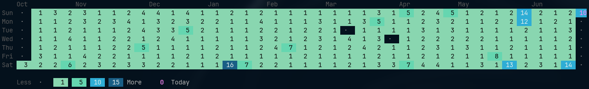
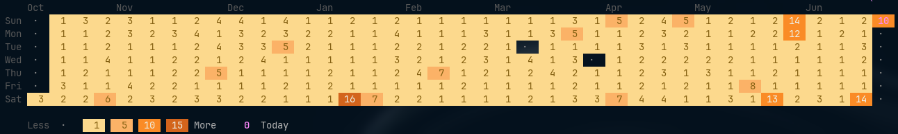
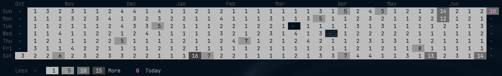

# gitviz Color Themes

Each theme works with the default compact graph and with `-numbers`.

Replace `your.email@example.com` with the email address used in your Git commits. If `git config user.email` is already set, you can omit `-graph`.

## Green

```sh
gitviz -graph your.email@example.com -numbers -color green
```



## Blue

```sh
gitviz -graph your.email@example.com -numbers -color blue
```


## Purple

```sh
gitviz -graph your.email@example.com -numbers -color purple
```


## Orange

```sh
gitviz -graph your.email@example.com -numbers -color orange
```



## Gray

```sh
gitviz -graph your.email@example.com -numbers -color gray
```


